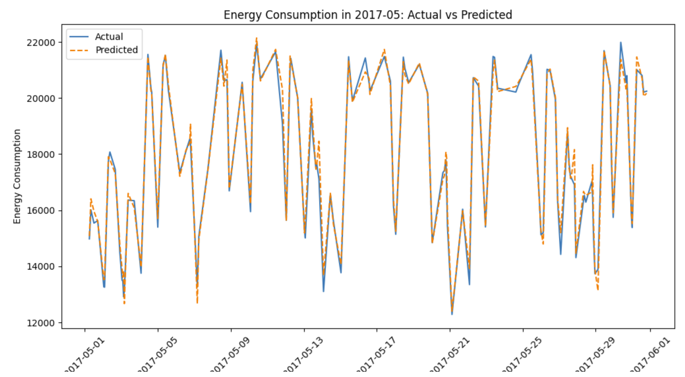

# Project 2: Energy Consumption Prediction and Analysis

## Description
This project focuses on analyzing energy consumption data to predict peak usage times and detect irregularities in power usage patterns. The solution leverages Apache Spark for batch processing and machine learning techniques to make predictions and detect anomalies.

## Dataset
The dataset used in this project is the **Open Power System Data**, which provides historical energy consumption records. The analysis is specifically focused on **electricity consumption data for Poland**.

## Objectives
- Ingest and preprocess historical energy consumption data.
- Utilize **Apache Spark** to process the dataset and analyze trends.
- Apply **Spark MLlib** machine learning models to predict peak demand times.
- Detect anomalies in energy usage patterns.
- Visualize the results and summarize findings in a markdown report.

## Technologies Used
- **Apache Spark** for distributed data processing
- **Python / Scala** for scripting and analysis
- **Spark MLlib** for machine learning predictions
- **AWS EMR** for cloud-based data processing
- **Matplotlib** for visualization

## Implementation
### Data Processing
1. Load historical power consumption data into Spark.
2. Clean and preprocess the dataset (handling missing values, formatting timestamps, and aggregating data).
3. Identify trends and anomalies in energy usage.

### Machine Learning Model
1. Train a model using **Spark MLlib** to predict peak demand times.
2. Evaluate model performance using test data.
3. Generate forecasts based on historical patterns.

### Anomaly Detection
- Anomalies in power usage were detected using statistical methods.
- Specifically, anomalies were identified by calculating the **mean and standard deviation** of consumption values, grouped by **month and day of the week**, as these factors significantly impact electricity usage.
- The detected anomalies were removed from the dataset before further analysis.
- A visualization is provided to highlight irregularities in consumption patterns.

## Files Overview
### `data_S3.ipynb`
This Jupyter Notebook is responsible for:
- Loading and preprocessing the dataset.
- Uploading the dataset to AWS S3.
- Performing initial exploratory data analysis (EDA) to understand power consumption patterns.

### `main.ipynb`
This Jupyter Notebook contains the main execution logic, which consists of the following steps:

1. **Load Processed Data:**
   - The notebook reads the preprocessed energy consumption data from AWS S3 into a Spark DataFrame.
   - It performs additional data transformation if necessary (e.g., converting timestamps, normalizing values).

2. **Feature Engineering:**
   - Extract relevant features from the dataset for model training.
   - Features include:
     - Three previous consumption values.
     - Information about the **month, day of the week, and hour**.
   - This feature selection ensures that the model accounts for historical trends and periodic variations in electricity consumption.

3. **Anomaly Detection:**
   - Identify anomalies using statistical methods (mean and standard deviation grouping by month and day of the week).
   - Remove detected anomalies from the dataset before model training.
   - Plot the detected anomalies in energy usage.

4. **Model Training using Spark MLlib:**
   - Define and configure a regression model (e.g., Decision Tree Regressor, Random Forest, or Gradient Boosting).
   - Split the dataset into training and test sets.
   - Train the model on the training set and evaluate performance on the test set.

5. **Prediction and Evaluation:**
   - Generate predictions on the test set.
   - Compare predicted values against actual energy consumption values.
   - Compute evaluation metrics such as RMSE (Root Mean Square Error) and R² Score.

6. **Visualization of Results:**
   - Generate plots illustrating actual vs. predicted energy consumption.
   - Provide six sample images from test set predictions.
   - Include a full-day prediction visualization based on initial consumption values.

## Results
- **Anomaly Detection Visualization:** A plot showcasing detected anomalies in energy consumption.
- **Prediction Examples:** Six sample images of test set predictions.
- **Full-day Prediction:** A graph showing an entire day's prediction based on the first three recorded consumption values.

## How to Run the Project
1. Ensure you have **Apache Spark** and **Python (or Scala)** installed.
2. Upload the dataset to AWS S3 (if using AWS EMR).
3. Run the provided notebooks (`data_S3.ipynb` and `main.ipynb`) to process the data and train the model.
4. Visualize the results using the generated plots.

## Conclusion
This project demonstrates how Apache Spark can be utilized to efficiently process and analyze large-scale energy consumption data. By using machine learning techniques, we successfully predict peak demand times and detect irregularities in usage patterns. The findings can be used for optimizing energy distribution and reducing waste.

## Visualization Results

### Anomaly Detection

### Prediction Examples

These examples demonstrate the model's ability to predict the next hour's electricity consumption based on the previous three hours. The results highlight the model's effectiveness in short-term forecasting, though further refinements could improve its accuracy.

### Full-Day Prediction
The model was used to predict energy consumption for an entire day based only on the first three consumption values of that day. The results show that while the model was too simple and lacked sufficient feature complexity to provide highly accurate predictions, it was able to capture general daily trends. Specifically, it correctly identified the tendency of electricity consumption to be higher during the day and lower at night. This suggests that while the model captures broad consumption patterns, further improvements are necessary to enhance its predictive accuracy.

### Future Work

While the current model provides a basic prediction of electricity consumption, there are several areas for improvement:

- Use of More Advanced Time Series Models: Instead of relying on a simple regression model, more advanced approaches such as Recurrent Neural Networks (RNNs), Long Short-Term Memory (LSTM) networks, or Transformer-based models could be explored for better handling of temporal dependencies.

- Incorporation of Additional Features: External factors such as weather conditions, holidays, temperature, and industrial activity could significantly impact power consumption and should be included in future models.

- Hyperparameter Tuning and Model Optimization: Further refinement of model parameters and tuning techniques like grid search or Bayesian optimization could improve predictive performance.

- Real-Time Processing: Integrating a real-time prediction pipeline using Kafka and Spark Streaming would allow for dynamic anomaly detection and immediate energy demand forecasting.
